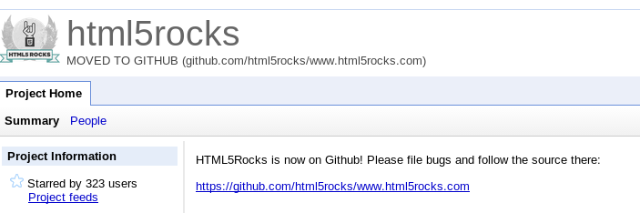

% GitHub & the Open Source Culture
% Zhang Yichao <zhang_yichao@vobile.cn>
% 4/9/2014

# The Open Source Culture

## Open Source at Large

- Work on Open Source platforms
    - GNU/Linux the Operating System
    - gcc & gdb
    - vim, terminal emulators, ...
- Live with Open Source software
    - Android, Linux in embedded systems: TVs, elevators, planes, bus stops, etc
    - Chrome, Firefox
    - Web sites built with JQuery & other JavaScript frameworks
    - ...

## Open Source Movement

- Use the Source, Luke!
    - Build using the source -> portable programs
    - Read the source        -> learn tricks
    - Write the source       -> contribute back
- To make a difference
    - Bug reports are a contribution
    - Maintain docs, package for distributions (DHH)
    - Write code, ya coders!

## Open Source Communities

- News Groups & BBS: dead yet?
- Mailing lists
    - List archives
    - Google Groups
- Forums
- Redit/HackerNews/InfoQ/...
- StackOverflow! ServerFault! StackExchange based sites

# GitHub

## GitHub the Web Site

- GitHub is a code sharing social network
    - Where you share code, and find code shared
    - Meet the people behind the code
    - -> Not just code, but the people!
- Do you remember Google Code?
    - Many projects moved to GitHub
    - Google is on GitHub too!
    - All code and no people makes Google Code a dull site

## On GitHub

## GitHub Tour

- Repo front page contains everything you need
    - README.md as introductory doc
    - First sight code listing
    - Search box
    - How to clone
    - Download ZIP
    - Fork
    - user / repo URL
- Wiki: GitHub Flavored Markdown everywhere, including issues
- Issues
- Pull Requests
- Meet the repo owner!
- OAuth & API

## Forks & Pull Requests

- Standard git workflow: Linux Kernel
    - Distributed, everyone has his own repo
    - Send patches to maintainer
    - Maintainer reviews & merges
    - Linus merges from subtrees (mm, fs, etc) and tags releases
- GitHub made it easy: pull requests
    - Fork upstream repo
    - Update your clone
    - Compare with upstream and create a pull request
    - Upstream owner reviews & merges

## Works for Vobile?

- Possible workflow
    - Experienced team members as module repo owners
    - Architect as product repo owner and tags releases
    - Everyone forks from owners' repos, and work on clones
    - Pull requests to owners, and finally to architects
    - Code review after commits but **before merges**
- GitHub/BitBucket private accounts
- GitHub/BitBucket Enterprise, GitLab, other well baked solutions
- Gitolite for forking without pull requests

# GitHub & Open Source

## Questions?

- Thanks!
